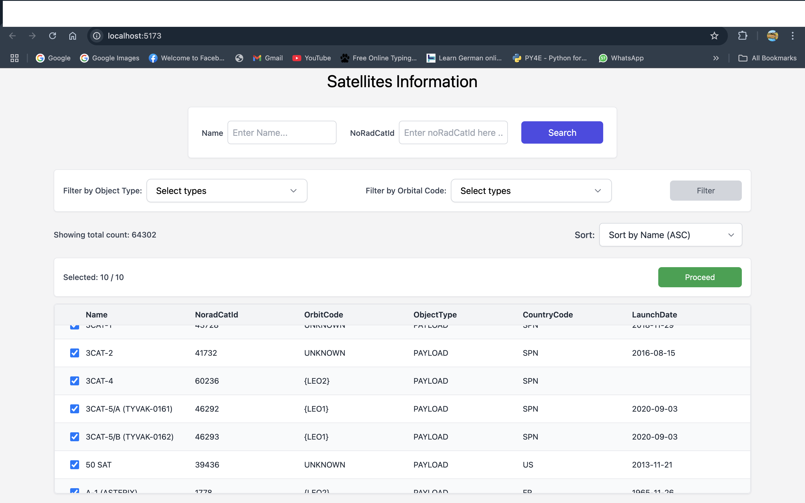
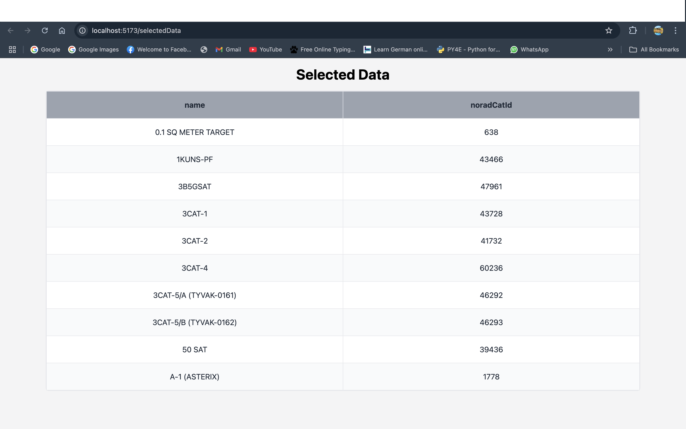

# Satellite Dashboard

This is a React + Vite project that renders a satellite dashboard.
An interactive frontend dashboard built with React and Tailwind CSS to display real-time satellite data, with search, filter, and sort functionalities.

## 📸 Screenshots




## Features

- Real-time search for satellite data with partial match support
- Dual search fields for both satellite name and noradCatId
- Multi-select dropdown filters for object type and orbital code
- Sort dropdown supporting sorting by name(ascending by default) and noradCatId
- Virtualized table for high-performance rendering of large datasets
- Row selection feature allowing up to 10 items to be selected
- Selected satellite data is stored in localStorage.
- Clicking the Proceed button navigates to a new page (/selectedData) that displays the selected satellite names along with their noradCatId
- Built using React, Tailwind CSS, and functional components

## Tech Stack

- **React** – Component-based UI
- **Tailwind CSS** – Utility-first CSS framework
- **Vite** – Fast dev environment and bundler
- **Virtualized Table** – For optimized rendering of large data sets

## Getting Started

### Prerequisites

- Node.js (v18 or above)
- npm (comes bundled with Node.js)

### Steps to Run

```bash
# Clone the repository
git clone https://github.com/PuneetSharm/drt_react_puneetkumarsharma

# Install dependencies
npm install

# Run development server
npm run dev

# Visit
http://localhost:<your-port>

```
